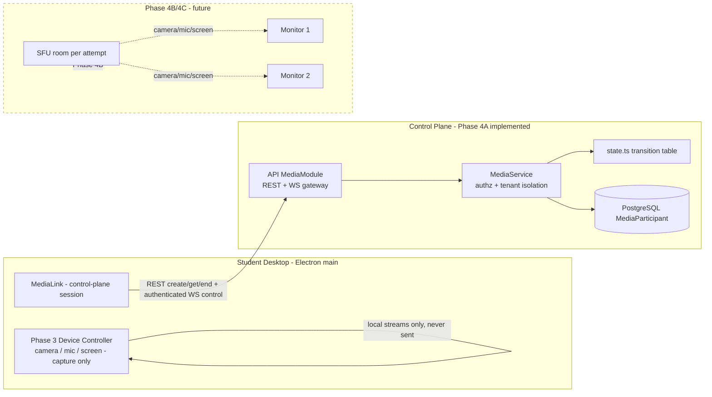

# ExamGuard — Media Signaling Architecture

> Phase 4A implements the authenticated media-session control plane only. No audio, video, screen media, WebRTC, SFU, recording, or AI is implemented. WebRTC/SFU transport is **Phase 4B/4C** — drawn below as future intent only.

## 1. Layered view



**Control plane vs media plane.** The control plane (this phase) authenticates, authorizes, and tracks session lifecycle. The media plane (future) moves RTP. No media bytes, SDP, or ICE traverse the control plane; no frames go over REST or WebSockets.

## 2. Session & participant model

One logical media session per attempt, keyed by `attemptId`:

```text
Organization ── Exam ── ExamAttempt ── MediaParticipant (mediaSessionId == participantId base)
                     └── DeviceSession ──┘
```

`MediaParticipant` fields: `organizationId`, `examId`, `attemptId`, `studentId`, `deviceSessionId`, `participantId`, `role`, `status`, `connectedAt`, `lastSeenAt`, `endedAt`, `reconnects`.

The participant identity is stable for the life of the attempt: reconnects restore the same row; the gateway rejects a second live connection for the same attempt (409).

## 3. REST API (control plane)

| Endpoint | Permission | Purpose |
|---|---|---|
| `POST /api/v1/media/sessions` | `media:publish` | Idempotent create/reuse for the caller's own active attempt |
| `GET /api/v1/media/sessions/:id` | `attempt:read` | Retrieve own session |
| `POST /api/v1/media/sessions/:id/end` | `media:publish` | Idempotent end |
| `GET /api/v1/media/sessions?examId=` | `media:subscribe` | Monitor discovery metadata |

All authorization is derived from the verified access token — client-supplied IDs are never trusted.

## 4. WebSocket gateway (`/api/v1/media/ws`)

Authenticated control channel. First message must be a join carrying the bearer token:

```text
publisher: { type: 'media-session-join', data: { token, attemptId } }
monitor:   { type: 'exam-watch-join', data: { token, examId } }
client:    { type: 'ping' } | { type: 'media-session-leave' }
server:    { type: 'joined', data: { mediaSessionId, participantId, attemptId, state } }
server:    { type: 'media-session-state', data: { participantId, state } }
server:    { type: 'media-participant-connected' | 'media-participant-state', data }
server:    { type: 'pong' } | { type: 'media-error', data: { code, message } }
```

Error codes: 401 auth, 403 tenant/exam/attempt, 409 duplicate connection, 429 rate limit, 400 malformed. Messages are counted per connection (60 / 10 s); the gateway caps total connections (500) and never crashes on malformed input.

## 5. State machine

States `CONNECTING | ACTIVE | RECONNECTING | DISCONNECTED | ENDED | FAILED` with a pure transition table (`services/api/src/media/state.ts`):

```text
CONNECTING ──connected──▶ ACTIVE ──disconnected──▶ RECONNECTING ──connected──▶ ACTIVE
   │  │                    │  │                        │  (same participant)   │
   │  └─ended/FAILED       │  └──ended/FAILED          └─expired─▶ DISCONNECTED
   └───────────────────────┴──────────────────────────────────────┘
                              ended (terminal) ──▶ ENDED / FAILED
```

## 6. Reconnect & duplicate prevention

- Socket loss → `RECONNECTING`, bounded backoff reconnects (client) within a 45 s server grace window → rejoin restores `ACTIVE` with the **same** `mediaSessionId`/`participantId`.
- A second simultaneous join for the same attempt is answered with `media-error 409`; the server never creates a second participant.
- Attempt submit/terminate closes the participant row (attempts service) so no orphaned ACTIVE sessions remain in the happy path.

## 7. Presence & durability

- Ephemeral: connection state, `lastSeenAt`, ping/pong — held in gateway memory; nothing per-ping touches PostgreSQL or audit.
- Durable: only meaningful lifecycle changes persist (`MediaParticipant` row transitions; `AuditLog` entries; `MEDIA_*` proctoring events via the desktop ReliableOutbox).

## 8. Security model

- JWT verified at join; every later message is bound to the verified identity.
- Chain checked server-side per operation: user → permissions → organization → exam → attempt → session.
- No permanent media credentials exist in this phase; no SFU secrets anywhere.
- Electron: `MediaLink` runs in the main process; no renderer IPC or Node exposure added; contextIsolation/sandbox untouched.

## 9. Tenant isolation (verified)

Org-B student cannot create/get/join an org-A session; org-B monitor cannot discover org-A sessions; student cannot use monitor discovery. E2E asserts each as a 404/403.

## 10. Intended future (Phase 4B/4C — NOT implemented)

```text
MediaParticipant (stable id)
   └── SFU room per attempt (router/transport per connection)
         ├── publisher: camera track, mic track, screen track (from Phase 3 device controller)
         └── subscribers: authorized monitors (camera/screen focus, focused audio)
```

Short-lived, room-scoped media tokens replace the plain access token inside the SFU signaling path; the control-plane session row remains the durable anchor. TURN/STUN and recording/AI remain later phases.
